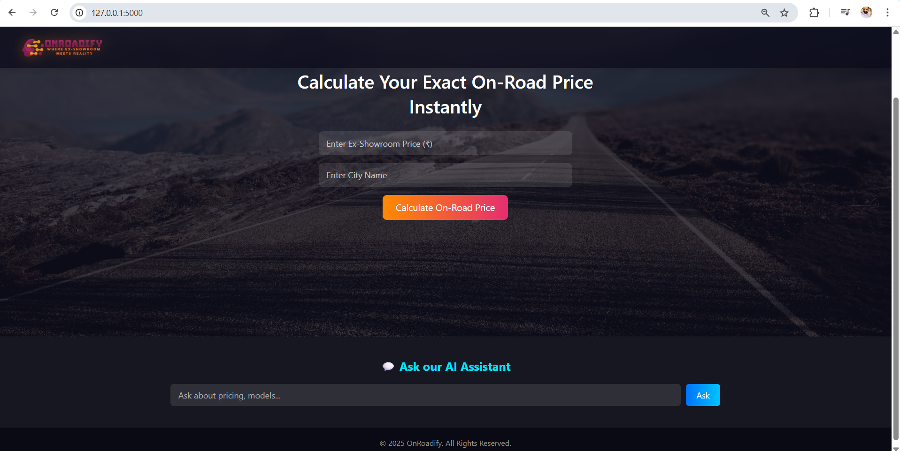

# 🛣️ OnRoadify – WHERE EX-SHOWROOM MEETS REALITY

OnRoadify is an AI-powered web application designed to simplify the process of finding the exact on-road price of any vehicle — whether it’s a car, bike or scooter. By entering just the ex-showroom price and city, users get a full price breakdown including taxes, registration and insurance — instantly. The app also features an AI Chat Assistant to answer questions about vehicle models, pricing trends, and comparisons.

## ⚙️ Tech Stack

* Component	Technology Used
* Frontend	HTML5, CSS3 (responsive with gradient + frosted glass UI)
* Backend	Python (Flask Framework)
* AI Integration	OpenAI API
* Version Control	Git \& GitHub
* Environment	Virtual Environment (venv)
* Deployment (future)	Flask local → Render / Hostinger / AWS

## 🧩 Features

* Instant On-Road Price Calculation — from ex-showroom price \& city
* AI Chatbot Assistant — answers pricing or model-related queries
* Fully Responsive \& Modern UI — inspired by CarDekho’s design
* Transparent Floating Navbar — logo-only aesthetic
* Glassmorphism Hero Section — futuristic, clean user experience
* Version Controlled Project — integrated with GitHub for updates
  
## 🗂️ Project Folder Structure

OnRoadify/
│
├── app.py                          # Main Flask application
├── requirements.txt                # Dependencies
├── .env                            # API key (not pushed to GitHub)
│
├── routes/
│   ├── \_\_init\_\_.py
│   └── ai\_routes.py                # AI Chat routes
│
├── services/
│   ├── \_\_init\_\_.py
│   └── ai\_service.py               # AI API integration logic
│
├── templates/
│   └── index.html                  # Main webpage layout
│
├── static/
│   ├── css/
│   │   └── style.css               # Modern UI styling
│   ├── js/
│   │   └── chatbot.js              # Handles AI chat logic
│   └── images/
│       └── OnRoadify-logo.png      # Project logo│
└── venv/                           # Python virtual environment

