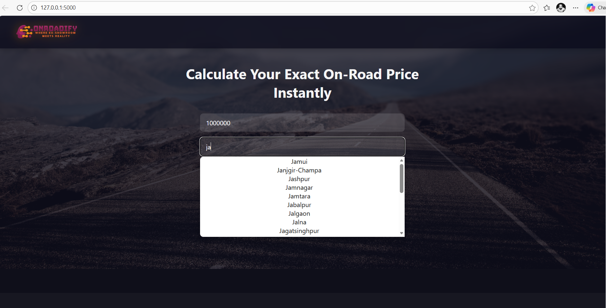
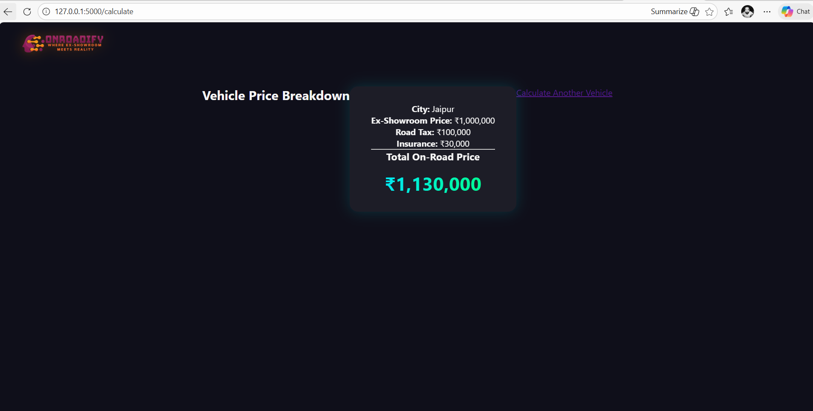

# OnRoadify – AI Vehicle On-Road Price Calculator
## Where Ex-Showroom Meets Reality

OnRoadify is a production-deployed, AI-powered web application that calculates the exact on-road price of a vehicle based on ex-showroom price and city-specific tax rules. It provides a transparent cost breakdown including road tax and insurance, along with an AI Assistant to answer vehicle pricing and policy questions.
[](https://onroadify.onrender.com)

🔗 Live Application:
👉 https://onroadify.onrender.com

## Application Preview




## Key Functionalities
### 1. On-Road Price Calculation (Core Logic)
* Users enter:
     - Ex-Showroom Price
     - City Name
* The system calculates:
     - State / City-specific Road Tax
     - Insurance (slab-based)
     - Final On-Road Price
📌 Logic handled via Flask backend using predefined tax slabs and insurance rules.

### 2. City Auto-Suggestion (Frontend Logic)
* Real-time city suggestions while typing (e.g., Jo → Jodhpur)
* Implemented using vanilla JavaScript
* Fully client-side, fast and lightweight
* Clean UX with click-to-select interaction

### 3. AI Chat Assistant
* Integrated with OpenAI API
* Answers questions related to:
  - Vehicle pricing
  - Taxes & registration
  - Comparisons & buying guidance
* Connected via secure backend route

### 4. Production Deployment (Live)
* Deployed on Render
* Public HTTPS URL
* Environment variables secured
* Auto-restarts & cloud-hosted backend

## Tech Stack
| Layer               | Technology                                    |
| ------------------- | --------------------------------------------- |
| **Frontend**        | HTML5, CSS3, Vanilla JavaScript               |
| **Backend**         | Python, Flask (Blueprint Architecture)        |
| **AI Integration**  | OpenAI API                                    |
| **UI Design**       | Gradient UI, Glassmorphism, Responsive Layout |
| **Version Control** | Git & GitHub                                  |
| **Deployment**      | Render (Gunicorn + Flask)                     |
| **Environment**     | Python Virtual Environment (venv)             |

## Business Logic Overview
### Road Tax (City-Based)
```python
STATE_TAX_RATES = {
    "default": 0.10,
    "delhi": 0.08,
    "mumbai": 0.11,
    "bangalore": 0.13,
    "chennai": 0.12,
    "hyderabad": 0.10,
    "jodhpur": 0.10,
    "jaipur": 0.10
}
```
### Insurance Calculation
```python
if ex_price <= 500000:
    insurance = 18000
elif ex_price <= 1000000:
    insurance = 30000
else:
    insurance = 45000
```

## Project Folder Structure
OnRoadify/
│
├── app.py                      # Flask app entry point
├── requirements.txt            # Production dependencies
├── .env                        # Environment variables (not pushed)
│
├── routes/
│   ├── __init__.py
│   ├── calculator_routes.py    # Price calculation logic
│   └── ai_routes.py            # AI chatbot API routes
│
├── services/
│   ├── __init__.py
│   └── ai_service.py           # OpenAI integration logic
│
├── templates/
│   ├── index.html              # Main UI
│   └── result.html             # Price breakdown page
│
├── static/
│   ├── css/
│   │   └── style.css           # Modern UI styling
│   ├── js/
│   │   ├── city-autocomplete.js
│   │   └── chatbot.js
│   └── images/
│       └── OnRoadify-logo.png
│
└── venv/                       # Virtual environment


## Deployment Details
**Hosting Platform:** Render
**Start Command:** gunicorn app:app
**Environment Variables:** FLASK_ENV=production
✔ Live HTTPS
✔ Cloud hosted
✔ Auto wake on traffic

## Use Cases
* Car / Bike buyers estimating real costs
* Automotive sales professionals
* Portfolio project for Full-Stack + AI Integration
* Demonstrates:
  - Backend logic
  - Frontend UX
  - API usage
  - Cloud deployment

## Future Enhancements
* Dynamic RTO tax from government APIs
* Vehicle model database
* EMI calculator
* Multi-state registration logic
* Authentication & user profiles

**⭐ If you find this project useful, feel free to star the repository and try the live app.**

## Connect with Me 🤝
If you found this project interesting, let’s connect!  

[](https://www.linkedin.com/in/sunil-prajapati832)  
 

